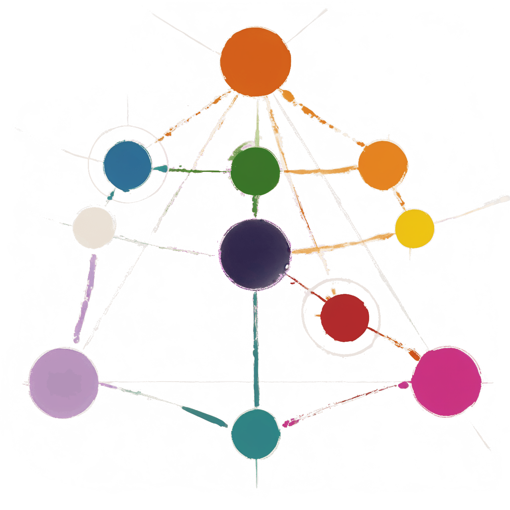

# Песнь Магических Сфер
*Из исследований Эцеда Ловца, старшего мага-исследователя Академии Драконов. Издательство 441го года Светлых времен*

## Глава 1: Введение

*В обширном введении к своему труду Эцед Ловец описывает тридцатилетний путь исследования магических потоков. Значительная часть главы посвящена его работе в личной лаборатории на одном из островов архипелага Академии Драконов, где он проводил свои самые важные эксперименты.*

*Особенно интересны его размышления о природе магических трансформаций и описание уникального комплекса исследовательских камер, созданного им для изучения различных аспектов магической энергии. Эцед подробно рассказывает о своих учениках, многие из которых впоследствии стали видными магами-исследователями.*

*Завершается глава рассуждениями о важности практического подхода к изучению магии и критикой излишне теоретических работ его предшественников.*

## Глава 2: Основы магической системы

*В начале главы Эцед Ловец подробно описывает историю изучения магических источников, ссылаясь на работы древних исследователей и свои ранние эксперименты. После обширного исторического экскурса он переходит к ключевым открытиям:*

Существование трёх первичных источников магической энергии – это краеугольный камень нашего понимания магии. Солнце, Лиловая луна и падшая Розовая луна формируют уникальный баланс сил, определяющий саму природу магии в нашем мире. В ходе многолетних наблюдений мне удалось установить, как эти источники взаимодействуют между собой и как их энергия трансформируется, создавая всё многообразие магических явлений.

*Следующие несколько страниц посвящены детальному описанию методов наблюдения за магическими потоками и специальным инструментам, разработанным автором. После технических деталей Эцед возвращается к сути своих открытий:*

Солнце является наиболее стабильным и изученным источником. Его магия достигает пика в полдень и отличается предсказуемым, циклическим характером. Интересно отметить, что сила солнечной магии не увеличивается линейно с высотой, как считалось ранее. В ходе исследований на разных уровнях мира я обнаружил существование "солнечного пояса" - оптимальной высоты, где концентрация солнечной магии максимальна. Именно на этой высоте расположено большинство магических академий, включая и нашу.

*Далее автор приводит многочисленные примеры измерений и наблюдений, подтверждающие его теорию о "солнечном поясе". В завершающей части главы он переходит к описанию более сложных источников:*

Лиловая луна представляет собой более сложный источник. Её влияние усиливается ночью и имеет выраженный приливно-отливный характер, подобный морским течениям. В отличие от солнечной магии, лиловая энергия глубоко влияет на саму структуру реальности, искажая не только физическую материю, но и разум живых существ.

*Глава завершается обширным приложением с диаграммами и таблицами измерений, а также подробным описанием экспериментов с различными магическими потоками.*

## Глава 3: Магическая вуаль

*В этой короткой, но важной главе Эцед Ловец отвлекается от основной темы цветовых трансформаций, чтобы поделиться своими наблюдениями о загадочной природе магической вуали. Он начинает с поэтичного сравнения:*

"Подобно тому, как океанские течения формируют жизнь морей, магическая вуаль струится сквозь уровни нашего мира, неслышно напевая свою вечную песню преображения."

*После нескольких страниц теоретических рассуждений и исторических справок, автор переходит к практическим наблюдениям:*

В своей лаборатории я провел серию тщательных наблюдений за взаимодействием вуали с живыми существами. Результаты оказались поразительными: чем более могущественным было существо, тем сильнее оно страдало при попытке подняться против потока вуали. Это противоречило всем предыдущим теориям о "силе преодоления". Как выяснилось, дело не в физической силе существа, а в количестве накопленной им магической энергии, которая вступает в противоречие с нисходящим потоком вуали.

*Следующие несколько страниц содержат подробные записи экспериментов и наблюдений, большинство из которых представляют чисто академический интерес. Завершается глава практическим выводом:*

Понимание природы магической вуали имеет огромное практическое значение. Оно позволяет нам правильно планировать перемещения между уровнями, проектировать защитные системы и даже предсказывать поведение магических существ.

*В приложении к главе приводятся схемы безопасных маршрутов перемещения между уровнями и рекомендации по проектированию транспортных систем.*

## Глава 4: Цвета магической энергии

*Четвертая и самая обширная глава труда Эцеда Ловца посвящена детальному исследованию различных проявлений магической энергии. Она разделена на несколько частей:*

### Первичные источники

**Солнечная магия** является самой стабильной и предсказуемой. Её поток достигает пика в полдень и минимален на закате. В чистом виде она проявляет себя как энергия созидания и роста. Работа с солнечной магией требует ясности мысли и четкого представления желаемого результата. Солнечная магия лежит в основе целительства и большинства созидательных практик, однако её избыток может быть так же опасен, как и недостаток - известны случаи, когда чрезмерное воздействие солнечной магии приводило к неконтролируемому росту живых тканей.

**Лиловая магия**, источаемая нашей луной, пожалуй, самая тревожная из всех. В ходе исследований я обнаружил её глубокое воздействие на разум любых существ - она порождает необъяснимые страхи, паранойю и подозрительность. Длительное воздействие лиловой магии вызывает необратимые трансформации - я документировал множество случаев, когда обычные животные и даже люди под её влиянием превращались в чудовищных созданий. Особенно тревожно, что эти изменения необратимы - даже золотая магия не способна полностью исцелить существо, искаженное лиловым светом.

**Розовая магия**, хотя её первичный источник утрачен с падением второй луны, продолжает влиять на наш мир через осколки этериума. Это магия, работающая с самой структурой реальности - она способна изменять фундаментальные свойства пространства, что мы наблюдаем в феномене летающих островов. Работа с розовой магией требует особой осторожности - она может усилить как намерения мага, так и его сомнения, создавая непредсказуемые эффекты.

### Преобразованные цвета

**Золотая магия**, рождающаяся непосредственно из солнечного света в моменты его наибольшей интенсивности, обладает мощными восстанавливающими свойствами. Это не просто целительная сила - в её присутствии материя стремится вернуться к своей идеальной, изначально задуманной природой форме. Работа с золотой магией требует от мага глубокого понимания природных форм и процессов. Именно поэтому целители, специализирующиеся на золотой магии, проводят годы в изучении анатомии и естественных структур. Характерной особенностью золотой магии является её "память" - она способна восстановить предмет или существо до состояния, в котором они пребывали до повреждения, если это состояние было естественным.

**Лучистая магия** рождается в точке встречи золотой и алой энергий, где созидательная сила природы сливается с трансформирующей мощью страсти. Эта магия воплощает чистую энергию преобразования, постоянно находящуюся в движении. В отличие от других форм магии, лучистая энергия никогда не бывает статичной - она всегда стремится к изменению окружающего мира, что делает её особенно опасной для неподготовленного мага. В своих экспериментах я обнаружил, что она особенно эффективна при работе с другими источниками света и тепла, способна усиливать или ослаблять их, создавая удивительные эффекты. Например, простое заклинание лучистой магии может превратить тусклое свечение в ослепительную вспышку или, наоборот, сделать палящий жар мягким теплом. Эта магия в равной степени способна как созидать, так и разрушать - всё зависит от того, какая из её составляющих преобладает в момент использования. Молодым магам я всегда советую начинать практику с малых концентраций, поскольку лучистая энергия чрезвычайно чувствительна к эмоциональному состоянию практикующего и легко выходит из-под контроля при избытке чувств. В моей лаборатории работа с лучистой магией проводится только в специально экранированных помещениях с системой магического заземления - слишком часто даже опытные маги недооценивают её взрывной потенциал.

**Голубая магия** возникает там, где солнечный и лиловый потоки соединяются в равной пропорции, позволяя силам созидания и изменения создавать основы материального мира. В своей лаборатории я провел сотни экспериментов, доказывающих её фундаментальную роль в создании и преобразовании базовых элементов. Особенно сильна её связь с водой - лазурная магия не просто позволяет управлять существующей влагой, но и способна извлекать её из окружающей энергии, конденсируя из воздуха или даже создавая из чистой магии. Одно из самых удивительных свойств лазурной магии - её стабильность на разных высотах. В то время как большинство магических энергий значительно меняют свои свойства при перемещении между уровнями мира, лазурная магия сохраняет свою силу практически неизменной даже в глубинах. Это делает её незаменимой для магов-путешественников и исследователей нижних уровней. При этом лазурная магия проявляет удивительную пластичность - в умелых руках она способна не только создавать воду, но и преобразовывать её в другие базовые элементы, что лежит в основе многих алхимических процессов.

**Белая магия** представляет собой уникальный результат взаимодействия природного и альтернативного созидания. Когда лиловая магия очищает естественную созидательную энергию, она создает особую форму магической силы - белую магию искусственного творения. В моей лаборатории есть специальная камера для изучения этого процесса, где мы можем наблюдать, как лиловое влияние постепенно преобразует природные магические потоки в чистейшую белую энергию. Эта форма магии обладает удивительной способностью усиливать действие других цветов, при этом не искажая их природу - она выступает как универсальный катализатор магических процессов. Именно поэтому она столь ценна в сложных магических операциях - белая магия способна многократно усилить эффект любого заклинания, сохраняя при этом его изначальную суть. Особенно впечатляющие результаты достигаются при сочетании белой магии с другими цветами - например, в комбинации с золотой она создает мощнейший восстанавливающий эффект, а в союзе с изумрудной позволяет достичь невероятной точности в работе с душами.

**Алая магия** рождается из союза солнечной и розовой энергий, воплощая в себе силу трансформации и страсти. Многие ошибочно считают её просто "магией огня", но это глубокое заблуждение. Алая энергия резонирует с сильными эмоциями и жизненной силой, делая её исключительно мощной, но и опасной в неумелых руках. В своих исследованиях я обнаружил, что она способна не только разрушать, но и преображать материю на глубинном уровне. Особенно интересно её влияние на живых существ - под воздействием алой магии они могут временно обретать удивительные способности, выходящие за рамки их обычных возможностей. Эта магия питается от эмоций заклинателя, усиливаясь от гнева и страсти, но также откликаясь на радость и воодушевление. В местах столкновения различных магических потоков алая магия действует как мощный катализатор изменений, ускоряя и усиливая все магические процессы. Однако её использование требует исключительного самоконтроля - малейшее колебание в эмоциональном состоянии мага может привести к непредсказуемым и часто разрушительным последствиям.

**Изумрудная магия**, рождённая из слияния лиловой и розовой энергий, обладает уникальной способностью взаимодействовать с самой сущностью жизни - душами существ. В ходе моих исследований я обнаружил, что она не просто "взаимодействует" с душами - она способна видеть и манипулировать тончайшими нитями, связывающими душу с телом. Эти нити, обычно невидимые для других форм магии, под влиянием изумрудной энергии проявляются как сложная сеть связей, определяющих саму природу существования. Это открытие объясняет поразительную эффективность изумрудной магии в создании нежити - она позволяет сохранить или восстановить связь души с телом даже после смерти. Однако её возможности простираются гораздо дальше - при правильном применении она незаменима в лечении душевных травм, восстановлении разорванных духовных связей и даже в помощи душам найти покой после смерти. В своей лаборатории я наблюдал, как неосторожное использование изумрудной магии может привести к непреднамеренному созданию призраков - фрагментов душ, застрявших между жизнью и смертью. Это делает её одной из самых опасных форм магии для неподготовленного практика - малейшая ошибка может иметь необратимые последствия не только для цели заклинания, но и для самого мага.

**Зеленая магия** занимает уникальное положение в спектре магических энергий. Находясь на пересечении нескольких потоков, она воплощает саму суть природного равновесия. В моих исследованиях я обнаружил, что зеленая магия не просто взаимодействует с живыми существами - она способна восстанавливать и поддерживать естественные циклы жизни. Особенно интересны её проявления в редких точках, где сходятся потоки от всех трёх первичных источников. Мне потребовалось организовать несколько экспедиций в южные архипелаги, прежде чем я обнаружил такое место. Помню, как был поражен, когда впервые увидел эту точку схождения - даже самые простые заклинания зеленой магии там давали удивительные результаты. К сожалению, воспроизвести подобные условия в моей лаборатории пока не удалось, несмотря на все попытки.

Особенно важно отметить способность зеленой магии к самовосстановлению и поддержанию баланса. В отличие от других видов магии, которые стремятся к изменению или преобразованию, зеленая магия всегда стремится к достижению естественного равновесия. Это делает её незаменимой в лечении длительных заболеваний, восстановлении нарушенных экосистем и даже в очищении территорий от вредоносных магических воздействий.

### Завершающая форма

**Темная магия**, вопреки распространенному мнению, не является противоположностью остальным видам магии. В действительности, как показали мои исследования, она представляет собой естественное завершение цикла магических трансформаций. Темная магия не "поглощает" другие виды магии, а скорее "очищает" их, возвращая энергию к изначальному состоянию. Именно поэтому самые мощные телепортационные заклинания используют темную магию - она способна на мгновение освободить материю от всех магических связей, позволяя ей перемещаться практически без ограничений.
В своей лаборатории я обнаружил, что темная магия особенно сильна в работе с пространством и временем. Она словно существует в промежутках между другими видами магии, заполняя пустоты и создавая возможности для новых трансформаций. Это свойство делает её незаменимой в создании магических хранилищ, защитных барьеров и порталов. Однако работа с темной магией требует особой осторожности - её очищающее воздействие может быть опасным для неподготовленного мага, способным нарушить его собственные магические способности.

*В этой главе автор не только описывает свойства каждого вида магии, но и приводит множество практических примеров их применения. Особенно ценны его наблюдения о взаимодействии различных цветов между собой и предостережения об опасностях неправильного обращения с магической энергией.*

## Глава 5: Практическое применение магических сфер

*Эцед Ловец начинает заключительную главу своего труда с примечательного наблюдения:*

"Магия подобна музыке - можно бесконечно изучать ноты, но лишь в момент исполнения рождается истинная мелодия."

### 5.1 О природной предрасположенности
*В первой части главы автор подробно описывает различные признаки магической предрасположенности. Наиболее важным он считает следующее наблюдение:*

Каждый маг имеет природную предрасположенность к определенному цвету магии. Это проявляется в том, как различные магические потоки откликаются на первые попытки взаимодействия с ними. Например, если начинающий маг обнаруживает, что растения тянутся к его магии, а мелкие раны в его присутствии заживают быстрее - это явный признак склонности к зеленой магии.

### 5.2 Особенности практической работы
*Большая часть этого раздела посвящена описанию различных магических техник и методов. Особенно важным представляется следующий отрывок:*

Один из самых эффективных методов обучения - это работа с малыми потоками магии. Многие стремятся сразу к масштабным заклинаниям, но истинное мастерство начинается с умения чувствовать и направлять тончайшие магические течения.

### 5.3 Меры предосторожности
*В заключительной части главы Эцед уделяет особое внимание вопросам безопасности. После нескольких страниц детальных инструкций он подводит итог:*

Техники безопасности при работе с магией должны стать второй натурой для любого практикующего мага. Особенно это касается работы с лиловой и изумрудной магией - эти энергии особенно коварны в своем влиянии на неподготовленный разум и душу. В своей лаборатории я использую систему многослойных защитных барьеров, настроенных на определенные частоты магической энергии.

*Глава завершается обширным приложением с практическими рекомендациями и схемами защитных конструкций, большинство из которых, впрочем, требуют глубокого понимания магической теории для их реализации.*

## Эпилог

*В заключении своего труда Эцед Ловец размышляет о будущем магических исследований. Особенно примечательны его последние строки:*

"Каждый раз, когда я думаю, что постиг природу магии, она являет мне новое чудо. Возможно, в этом и есть её истинная суть - вечно меняться, вечно течь, подобно песне, которая никогда не будет спета до конца."

*Далее следует несколько страниц благодарностей его ученикам и коллегам из Академии Драконов, а также список источников и ссылок на другие магические труды. Книга завершается детальным предметным указателем и коллекцией зачарованных диаграмм, демонстрирующих взаимодействие различных магических потоков.*
